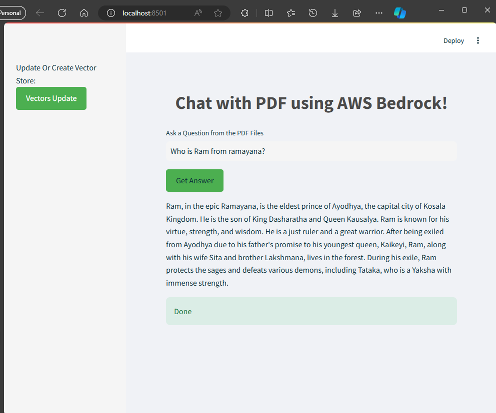
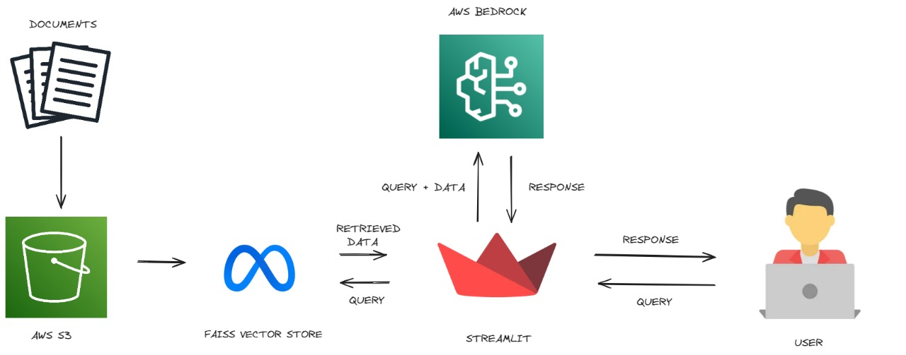

# RAG-on-Bedrock

This Streamlit web application allows users to ask questions about PDF files stored in an S3 bucket. The app uses AWS Bedrock for language model inference and Hugging Face for generating text embeddings.

## Features

- Load PDF documents from an **S3 bucket**
- Split documents into manageable chunks and more using **Langchain**
- Generate embeddings using **Hugging Face**
- Create and save a **FAISS vector store** from the document chunks
- Retrieve relevant document chunks and generate responses using **AWS Bedrock** language models
- User-friendly interface with custom styling on **Streamlit**

## Output



## Architecture



## Installation

1. **Clone the repository:**

    ```bash
    git clone https://github.com/yourusername/your-repo-name.git
    cd your-repo-name
    ```

2. **Create and activate a virtual environment:**

    ```bash
    python -m venv venv
    source venv/bin/activate  # On Windows use `venv\Scripts\activate`
    ```

3. **Install the required packages:**

    ```bash
    pip install -r requirements.txt
    ```

4. **Set up environment variables:**

    Create a `.env` file in the root directory of the project and add your environment variables:

    ```bash
    AWS_ACCESS_KEY_ID=your-access-key-id
    AWS_SECRET_ACCESS_KEY=your-secret-access-key
    AWS_REGION=your-aws-region
    ```

## Usage

1. **Run the Streamlit application:**

    ```bash
    streamlit run app.py
    ```

2. **Interact with the app:**

    - **Ask a Question:** Type your question about the PDF files in the input field.
    - **Update or Create Vector Store:** Use the sidebar to load and process documents from the S3 bucket and update the vector store.
